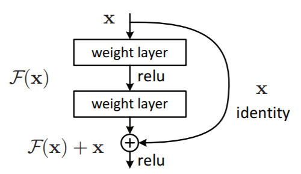
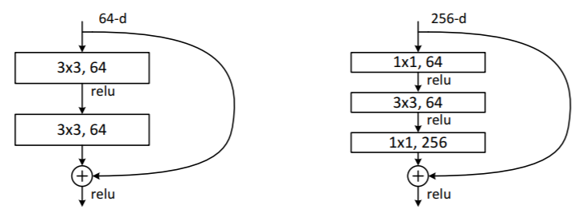
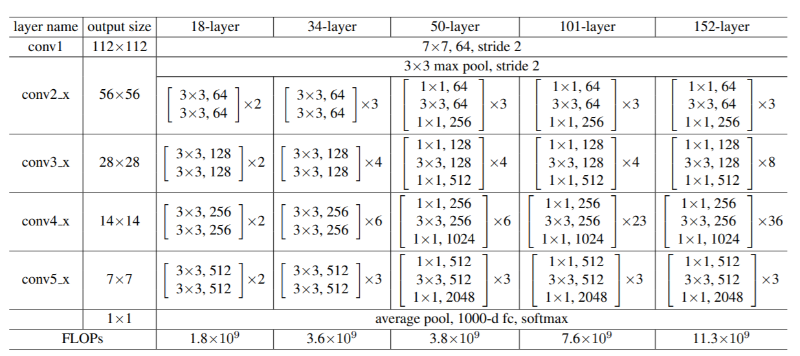
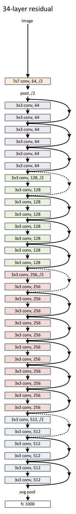

# Residual Networks
## Summary

Plain deep neural networks suffer from convergence problems with more layers in the network. 
RestNet has been introduced to solve this problem make it possible to achieve better results with deeper networks without increasing training error. 
This architecture has been proposed by **[1]** and won ILSVRC and COCO 2015 competitions.

Basically, a deeper network should not produce a higher training error. 
Indeed, it should at least use identity functions in excess layers. 
But, in practice this is not the case. Thus, this suggests that deep layers are unable to detect identity functions. 
Actually, this hypothesis motivated Residual connections in deep networks.

Residual network is a **stack** of residual building blocks. 
Each of them is composed of 2 or 3 plain layers and a residual layers merged with an element wise addition (Figure 1).

RestNet architectures are composed basically of two types of building blocks.
The first one is a building block and the second is a bottelneck block (Figure 2).

The paper proposes five architectures that differ basically in layers number, filters number per layer and use of bottelneck block building (Figure 3).
In (Figure 4), an illustration of 34 residual layer.

## References

He, K., Zhang, X., Ren, S. and Sun, J., 2016. Deep residual learning for image recognition. In Proceedings of the IEEE conference on computer vision and pattern recognition (pp. 770-778).
